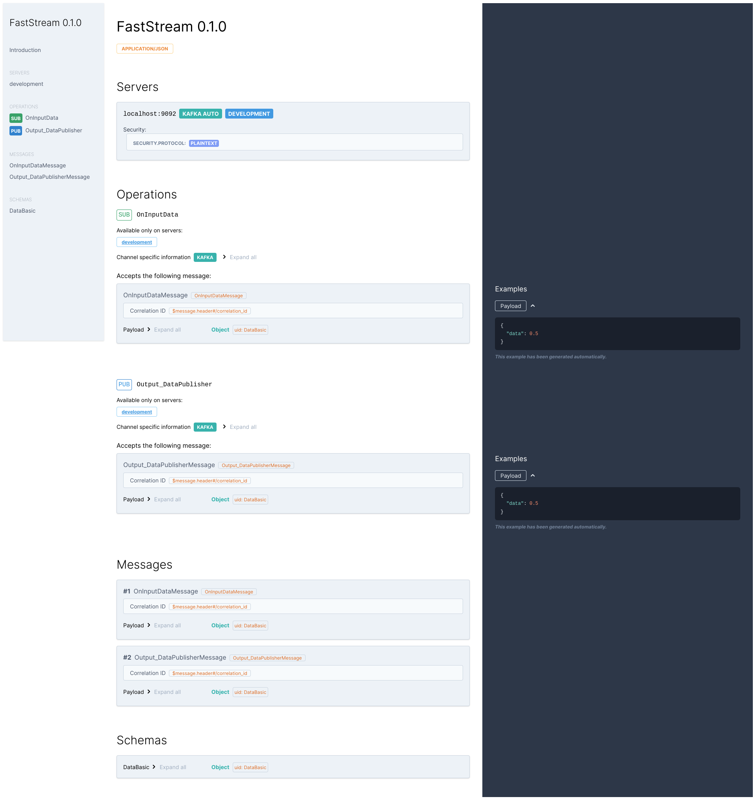

---
hide:
  - navigation
search:
  exclude: true
---

# FastStream

<b>Effortless event stream integration for your services</b>

---

<p align="center">
  <a href="https://trendshift.io/repositories/3043" target="_blank"></a>

  <br/>
  <br/>

  <a href="https://github.com/ag2ai/faststream/actions/workflows/pr_tests.yaml" target="_blank">
    
  </a>

  <a href="https://coverage-badge.samuelcolvin.workers.dev/redirect/ag2ai/faststream" target="_blank">
      
  </a>

  <a href="https://www.pepy.tech/projects/faststream" target="_blank">
    
  </a>

  <a href="https://pypi.org/project/faststream" target="_blank">
    
  </a>

  <a href="https://pypi.org/project/faststream" target="_blank">
    
  </a>

  <br/>

  <a href="https://github.com/ag2ai/faststream/actions/workflows/pr_codeql.yaml" target="_blank">
    
  </a>

  <a href="https://github.com/ag2ai/faststream/actions/workflows/pr_dependency-review.yaml" target="_blank">
    
  </a>

  <a href="https://github.com/ag2ai/faststream/blob/main/LICENSE" target="_blank">
    
  </a>

  <a href="https://github.com/ag2ai/faststream/blob/main/CODE_OF_CONDUCT.md" target="_blank">
    
  </a>

  <br/>

  <a href="https://discord.gg/qFm6aSqq59" target="_blank">
      
  </a>

  

  <a href="https://t.me/python_faststream" target="_blank">
    
  </a>

  <br/>

  <a href="https://gurubase.io/g/faststream" target="_blank">
    
  </a>
</p>

---

## Features

[**FastStream**](https://faststream.airt.ai/) simplifies the process of writing producers and consumers for message queues, handling all the
parsing, networking and documentation generation automatically.

Making streaming microservices has never been easier. Designed with junior developers in mind, **FastStream** simplifies your work while keeping the door open for more advanced use cases. Here's a look at the core features that make **FastStream** a go-to framework for modern, data-centric microservices.

- **Multiple Brokers**: **FastStream** provides a unified API to work across multiple message brokers ([**Kafka**](https://kafka.apache.org/){target="_blank"} [using [**AIOKafka**](https://github.com/aio-libs/aiokafka){target="_blank"} & [**Confluent**](https://github.com/confluentinc/confluent-kafka-python){target="_blank"}], [**RabbitMQ**](https://www.rabbitmq.com/){target="_blank"}, [**NATS**](https://nats.io/){target="_blank"}, [**Redis**](https://redis.io/){.external-link target="_blank"} support)

- [**Pydantic Validation**](#writing-app-code): Leverage [**Pydantic's**](https://docs.pydantic.dev/){.external-link target="_blank"} validation capabilities to serialize and validates incoming messages

- [**Automatic Docs**](#project-documentation): Stay ahead with automatic [**AsyncAPI**](https://www.asyncapi.com/){.external-link target="_blank"} documentation

- **Intuitive**: Full-typed editor support makes your development experience smooth, catching errors before they reach runtime

- [**Powerful Dependency Injection System**](#dependencies): Manage your service dependencies efficiently with **FastStream**'s built-in DI system

- [**Testable**](#testing-the-service): Supports in-memory tests, making your CI/CD pipeline faster and more reliable

- **Extensible**: Use extensions for lifespans, custom serialization and middleware

- [**Integrations**](#any-framework): **FastStream** is fully compatible with any HTTP framework you want ([**FastAPI**](#fastapi-plugin) especially)

That's **FastStream** in a nutshell—easy, efficient, and powerful. Whether you're just starting with streaming microservices or looking to scale, **FastStream** has got you covered.

---

## History

**FastStream** is a new package based on the ideas and experiences gained from [**FastKafka**](https://github.com/airtai/fastkafka){.external-link target="_blank"} and [**Propan**](https://github.com/lancetnik/propan){.external-link target="_blank"}. By joining our forces, we picked up the best from both packages and created a unified way to write services capable of processing streamed data regardless of the underlying protocol. We'll continue to maintain both packages, but new development will be in this project. If you are starting a new service, this package is the recommended way to do it.

---

## Install

**FastStream** works on **Linux**, **macOS**, **Windows** and most **Unix**-style operating systems.
You can install it with `pip` as usual:

=== "AIOKafka"
    ```sh
    pip install faststream[kafka]
    ```

=== "Confluent"
    ```sh
    pip install faststream[confluent]
    ```

=== "RabbitMQ"
    ```sh
    pip install faststream[rabbit]
    ```

=== "NATS"
    ```sh
    pip install faststream[nats]
    ```

=== "Redis"
    ```sh
    pip install faststream[redis]
    ```


!!! tip ""
    By default **FastStream** uses **PydanticV2** written in **Rust**, but you can downgrade it manually, if your platform has no **Rust** support - **FastStream** will work correctly with **PydanticV1** as well.

---

## Writing app code

**FastStream** brokers provide convenient function decorators `#!python @broker.subscriber(...)`
and `#!python @broker.publisher(...)` to allow you to delegate the actual process of:

- consuming and producing data to Event queues, and

- decoding and encoding JSON encoded messages

These decorators make it easy to specify the processing logic for your consumers and producers, allowing you to focus on the core business logic of your application without worrying about the underlying integration.

Also, **FastStream** uses [**Pydantic**](https://docs.pydantic.dev/){.external-link target="_blank"} to parse input
JSON-encoded data into Python objects, making it easy to work with structured data in your applications, so you can serialize your input messages just using type annotations.

Here is an example Python app using **FastStream** that consumes data from an incoming data stream and outputs the data to another one:

=== "AIOKafka"
    ```python linenums="1" hl_lines="9"
    {!> docs_src/index/kafka/basic.py!}
    ```

=== "Confluent"
    ```python linenums="1" hl_lines="9"
    {!> docs_src/index/confluent/basic.py!}
    ```

=== "RabbitMQ"
    ```python linenums="1" hl_lines="9"
    {!> docs_src/index/rabbit/basic.py!}
    ```

=== "NATS"
    ```python linenums="1" hl_lines="9"
    {!> docs_src/index/nats/basic.py!}
    ```

=== "Redis"
    ```python linenums="1" hl_lines="9"
    {!> docs_src/index/redis/basic.py!}
    ```

Also, **Pydantic**’s [`BaseModel`](https://docs.pydantic.dev/usage/models/){.external-link target="_blank"} class allows you
to define messages using a declarative syntax, making it easy to specify the fields and types of your messages.

=== "AIOKafka"
    ```python linenums="1" hl_lines="1 8 14"
    {!> docs_src/index/kafka/pydantic.py !}
    ```

=== "Confluent"
    ```python linenums="1" hl_lines="1 8 14"
    {!> docs_src/index/confluent/pydantic.py !}
    ```

=== "RabbitMQ"
    ```python linenums="1" hl_lines="1 8 14"
    {!> docs_src/index/rabbit/pydantic.py !}
    ```

=== "NATS"
    ```python linenums="1" hl_lines="1 8 14"
    {!> docs_src/index/nats/pydantic.py !}
    ```

=== "Redis"
    ```python linenums="1" hl_lines="1 8 14"
    {!> docs_src/index/redis/pydantic.py !}
    ```

---

## Testing the service

The service can be tested using the `TestBroker` context managers, which, by default, puts the Broker into "testing mode".

The Tester will redirect your `subscriber` and `publisher` decorated functions to the InMemory brokers, allowing you to quickly test your app without the need for a running broker and all its dependencies.

Using pytest, the test for our service would look like this:

=== "AIOKafka"
    ```python linenums="1" hl_lines="5 10 18-19"
    # Code above omitted 👆

    {!> docs_src/index/kafka/test.py [ln:3-21] !}
    ```

=== "Confluent"
    ```python linenums="1" hl_lines="5 10 18-19"
    # Code above omitted 👆

    {!> docs_src/index/confluent/test.py [ln:3-21] !}
    ```

=== "RabbitMQ"
    ```python linenums="1" hl_lines="5 10 18-19"
    # Code above omitted 👆

    {!> docs_src/index/rabbit/test.py [ln:3-21] !}
    ```

=== "NATS"
    ```python linenums="1" hl_lines="5 10 18-19"
    # Code above omitted 👆

    {!> docs_src/index/nats/test.py [ln:3-21] !}
    ```

=== "Redis"
    ```python linenums="1" hl_lines="5 10 18-19"
    # Code above omitted 👆

    {!> docs_src/index/redis/test.py [ln:3-21] !}
    ```


## Running the application

The application can be started using the built-in **FastStream** CLI command.

!!! note
    Before running the service, install **FastStream CLI** using the following command:
    ```shell
    pip install "faststream[cli]"
    ```

To run the service, use the **FastStream CLI** command and pass the module (in this case, the file where the app implementation is located) and the app symbol to the command.

```shell
faststream run basic:app
```

After running the command, you should see the following output:

```{.shell .no-copy}
INFO     - FastStream app starting...
INFO     - input_data |            - `HandleMsg` waiting for messages
INFO     - FastStream app started successfully! To exit press CTRL+C
```
{ data-search-exclude }

Also, **FastStream** provides you with a great hot reload feature to improve your Development Experience

```shell
faststream run basic:app --reload
```

And multiprocessing horizontal scaling feature as well:

```shell
faststream run basic:app --workers 3
```

You can Learn more about **CLI** features [here](./getting-started/cli/index.md){.internal-link}

---

## Project Documentation

**FastStream** automatically generates documentation for your project according to the [**AsyncAPI**](https://www.asyncapi.com/){.external-link target="_blank"} specification. You can work with both generated artifacts and place a web view of your documentation on resources available to related teams.

The availability of such documentation significantly simplifies the integration of services: you can immediately see what channels and message formats the application works with. And most importantly, it won't cost anything - **FastStream** has already created the docs for you!

{ .on-glb loading=lazy }

---

## Dependencies

**FastStream** (thanks to [**FastDepends**](https://lancetnik.github.io/FastDepends/){.external-link target="_blank"}) has a dependency management system similar to `pytest fixtures` and `FastAPI Depends` at the same time. Function arguments declare which dependencies you want are needed, and a special decorator delivers them from the global Context object.

```python linenums="1" hl_lines="8-9"
{! docs_src/index/dependencies.py [ln:1,5-14] !}
```

---

## HTTP Frameworks integrations

### Any Framework

You can use **FastStream** `MQBrokers` without a `FastStream` application.
Just *start* and *stop* them according to your application's lifespan.

=== "Litestar"
    ```python linenums="1" hl_lines="2 4 16 17"
    {!> docs_src/integrations/http_frameworks_integrations/litestar.py !}
    ```

=== "Aiohttp"
    ```python linenums="1" hl_lines="3 5 8-10 13-14 17-18 27-28"
    {!> docs_src/integrations/http_frameworks_integrations/aiohttp.py !}
    ```

=== "Blacksheep"
    ```python linenums="1" hl_lines="3 5 10-12 15-17 20-22"
    {!> docs_src/integrations/http_frameworks_integrations/blacksheep.py !}
    ```

=== "Falcon"
    ```python linenums="1" hl_lines="4 6 9-11 26-31 35"
    {!> docs_src/integrations/http_frameworks_integrations/falcon.py !}
    ```

=== "Quart"
    ```python linenums="1" hl_lines="3 5 10-12 15-17 20-22"
    {!> docs_src/integrations/http_frameworks_integrations/quart.py !}
    ```

=== "Sanic"
    ```python linenums="1" hl_lines="4 6 11-13 16-18 21-23"
    {!> docs_src/integrations/http_frameworks_integrations/sanic.py !}
    ```

### **FastAPI** Plugin

Also, **FastStream** can be used as part of **FastAPI**.

Just import a **StreamRouter** you need and declare the message handler with the same `#!python @router.subscriber(...)` and `#!python @router.publisher(...)` decorators.

!!! tip
    When used this way, **FastStream** does not utilize its own dependency and serialization system but integrates seamlessly into **FastAPI**.
    This means you can use `Depends`, `BackgroundTasks`, and other **FastAPI** tools as if it were a regular HTTP endpoint.

=== "AIOKafka"
    ```python linenums="1" hl_lines="4 6 14-18 24-25"
    {!> docs_src/integrations/fastapi/kafka/base.py !}
    ```

=== "Confluent"
    ```python linenums="1" hl_lines="4 6 14-18 24-25"
    {!> docs_src/integrations/fastapi/confluent/base.py !}
    ```

=== "RabbitMQ"
    ```python linenums="1" hl_lines="4 6 14-18 24-25"
    {!> docs_src/integrations/fastapi/rabbit/base.py !}
    ```

=== "NATS"
    ```python linenums="1" hl_lines="4 6 14-18 24-25"
    {!> docs_src/integrations/fastapi/nats/base.py !}
    ```

=== "Redis"
    ```python linenums="1" hl_lines="4 6 14-18 24-25"
    {!> docs_src/integrations/fastapi/redis/base.py !}
    ```

!!! note
    More integration features can be found [here](./getting-started/integrations/fastapi/index.md){.internal-link}

---

## Contributors

Thanks to all of these amazing people who made the project better!

<a href="https://github.com/ag2ai/faststream/graphs/contributors">
  
</a>
