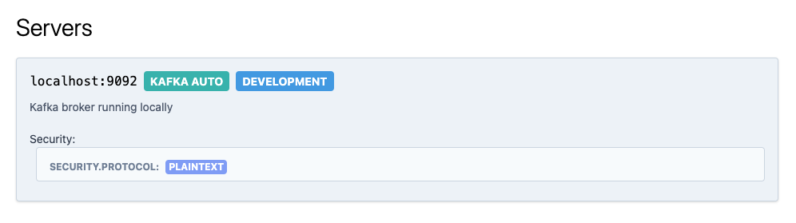
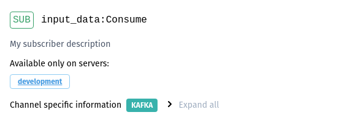
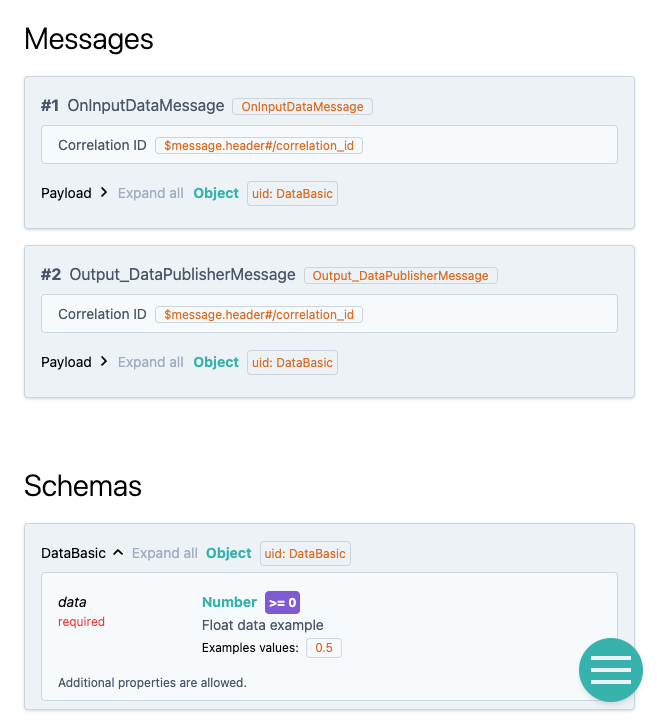

---
# 0.5 - API
# 2 - Release
# 3 - Contributing
# 5 - Template Page
# 10 - Default
search:
  boost: 10
---

# Customizing AsyncAPI Documentation for FastStream

In this guide, we will explore how to customize **AsyncAPI** documentation for your **FastStream** application. Whether you want to add custom app info, broker information, handlers, or fine-tune payload details, we'll walk you through each step.

## Prerequisites

Before we dive into customization, ensure you have a basic **FastStream** application up and running. If you haven't done that yet, let's setup a simple application right now.

Copy the following code in your basic.py file:

```python linenums="1"
{! docs_src/getting_started/asyncapi/asyncapi_customization/basic.py !}
```

Now, when you run
```shell
{! docs_src/getting_started/asyncapi/serve.py [ln:17] !}
```
you should see the following documentation:

{ .on-glb loading=lazy }

## Setup Custom FastStream App Info

Let's start by customizing the app information that appears in your **AsyncAPI** documentation. This is a great way to give your documentation a personal touch. Here's how:

1. Locate the app configuration in your **FastStream** application.
2. Update the `title`, `version`, and `description` fields to reflect your application's details.
3. Save the changes.
4. Serve your **FastStream** app documentation.

Copy the following code in your basic.py file, we have highlighted the additional info passed to **FastStream** app:

```python linenums="1" hl_lines="6-16"
{! docs_src/getting_started/asyncapi/asyncapi_customization/custom_info.py !}
```

Now, when you run
```shell
{! docs_src/getting_started/asyncapi/serve.py [ln:17] !}
```
you should see the following in your general app documentation:

{ .on-glb loading=lazy }

Now, your documentation reflects your application's identity and purpose.

!!! note
    The `description` field in the above example supports `Markdown` text.

## Setup Custom Broker Information

The next step is to customize broker information. This helps users understand the messaging system your application uses. Follow these steps:

1. Locate the broker configuration in your **FastStream** application.
1. Update the `description` field.
1. Update the `asyncapi_url` field with a non-sensitive URL if you want to conceal your broker's actual bootstrap server URL.
1. Save the changes.
1. Serve your **FastStream** app.

Copy the following code in your basic.py file, we have highlighted the additional info passed to the **FastStream** app broker:

```python linenums="1" hl_lines="5-9"
{! docs_src/getting_started/asyncapi/asyncapi_customization/custom_broker.py !}
```

Now, when you run
```shell
{! docs_src/getting_started/asyncapi/serve.py [ln:17] !}
```
you should see the description in your broker documentation:

{ .on-glb loading=lazy }

Your **AsyncAPI** documentation now provides clear insights into the messaging infrastructure you're using.

## Setup Custom Handler Information

Customizing handler information helps users comprehend the purpose and behavior of each message handler. Here's how to do it:

1. Navigate to your handler definitions in your **FastStream** application.
1. Add descriptions to each handler using `description` field.
1. For subscriber, consumer function's docstring can be used as `description`.
1. Add titles to each handler using `title` field adhering to [URI format](https://datatracker.ietf.org/doc/html/rfc3986).
1. Add publishing schema to publisher handler using `schema` field.
1. Save the changes.
1. Serve your **FastStream** app.

Copy the following code in your basic.py file, we have highlighted the additional info passed to the **FastStream** app handlers:

```python linenums="1" hl_lines="17-25 27-31"
{! docs_src/getting_started/asyncapi/asyncapi_customization/custom_handler.py !}
```

Now, when you run
```shell
{! docs_src/getting_started/asyncapi/serve.py [ln:17] !}
```
you should see the descriptions in your handlers:

{ .on-glb loading=lazy }

Now, your documentation is enriched with meaningful details about each message handler.

## Setup Payload Information via Pydantic Model

To describe your message payload effectively, you can use Pydantic models. Here's how:

1. Define Pydantic models for your message payloads.
2. Annotate these models with descriptions and examples.
3. Use these models as argument types or return types in your handlers.
4. Save the changes.
5. Serve your **FastStream** app.

Copy the following code in your basic.py file, we have highlighted the creation of payload info and you can see it being passed to the return type and the `msg` argument type in the `on_input_data` function:

```python linenums="1" hl_lines="7-10 19"
{! docs_src/getting_started/asyncapi/asyncapi_customization/payload_info.py !}
```

Now, when you run
```shell
{! docs_src/getting_started/asyncapi/serve.py [ln:17] !}
```
you should see the payload schema described in your documentation:

{ .on-glb loading=lazy }

Your **AsyncAPI** documentation now showcases well-structured payload information.

## Generate Schema.json, customize and serve it

To take customization to the next level, you can manually modify the schema.json file. Follow these steps:

1. Generate the initial schema.json by running
   ```shell
   {! docs_src/getting_started/asyncapi/serve.py [ln:9] !}
   ```
2. Manually edit the `asyncapi.json` file to add custom fields, descriptions, and details.
3. Save your changes.
4. Serve your **FastStream** app with the updated asyncapi.json by running
   ```shell
   {! docs_src/getting_started/asyncapi/serve.py [ln:21] !}
   ```

Now, you have fine-tuned control over your **AsyncAPI** documentation.

## Conclusion

Customizing **AsyncAPI** documentation for your **FastStream** application not only enhances its appearance but also provides valuable insights to users. With these steps, you can create documentation that's not only informative but also uniquely yours.

Happy coding with your customized **FastStream** **AsyncAPI** documentation!
