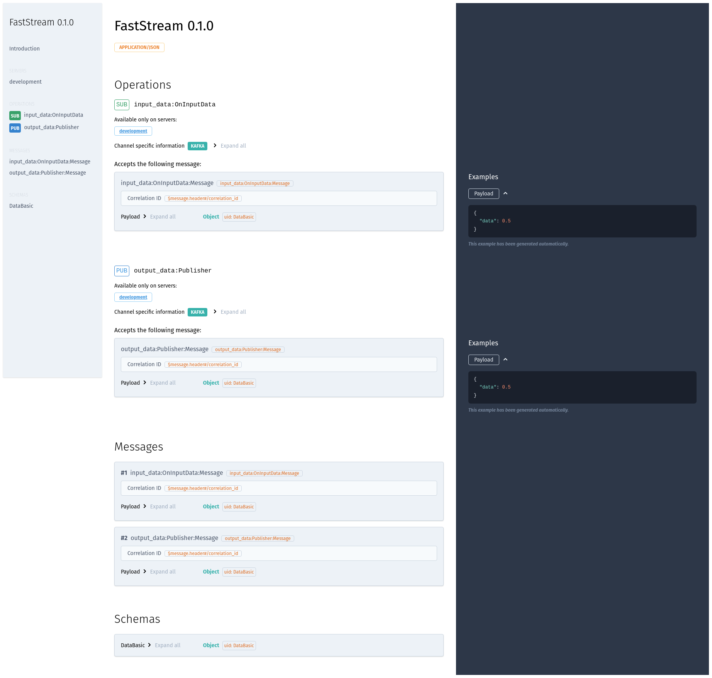

---
# 0.5 - API
# 2 - Release
# 3 - Contributing
# 5 - Template Page
# 10 - Default
search:
  boost: 10
---

# Serving the AsyncAPI Documentation

FastStream provides a command to serve the AsyncAPI documentation.

!!! note
    This feature requires an Internet connection to obtain the **AsyncAPI HTML** via **CDN**.

```shell
{! docs_src/getting_started/asyncapi/serve.py [ln:17] !}
```

In the above command, we are providing the path in the format of `python_module:FastStream`. Alternatively, you can also specify `asyncapi.json` or `asyncapi.yaml` to serve the AsyncAPI documentation.

=== "JSON"
    ```shell
    {!> docs_src/getting_started/asyncapi/serve.py [ln:21] !}
    ```

=== "YAML"
    ```shell
    {!> docs_src/getting_started/asyncapi/serve.py [ln:25] !}
    ```

After running the command, it should serve the AsyncAPI documentation on port **8000** and display the following logs in the terminal.

```{.shell .no-copy}
INFO:     Started server process [2364992]
INFO:     Waiting for application startup.
INFO:     Application startup complete.
INFO:     Uvicorn running on http://localhost:8000 (Press CTRL+C to quit)
```
{ data-search-exclude }

And you should be able to see the following page in your browser:

=== "Short"
    { .on-glb loading=lazy }

=== "Expand"
    { .on-glb loading=lazy }

!!! tip
    The command also offers options to serve the documentation on a different host and port.

## Customizing AsyncAPI Documentation

FastStream also provides query parameters to show and hide specific sections of AsyncAPI documentation.

You can use the following parameters control the visibility of relevant sections:

1. `sidebar`: Whether to include the sidebar. Default is true.
1. `info`: Whether to include the info section. Default is true.
1. `servers`: Whether to include the servers section. Default is true.
1. `operations`: Whether to include the operations section. Default is true.
1. `messages`: Whether to include the messages section. Default is true.
1. `schemas`: Whether to include the schemas section. Default is true.
1. `errors`: Whether to include the errors section. Default is true.
1. `expandMessageExamples`: Whether to expand message examples. Default is true.

For example, to hide the entire `Servers` section of the documentation, simply add `servers=false` as a query parameter, i.e., <http://localhost:8000?servers=false>. The resulting page would look like the image below:

{ .on-glb loading=lazy }

Please use the above-listed query parameters to show and hide sections of the AsyncAPI documentation.
